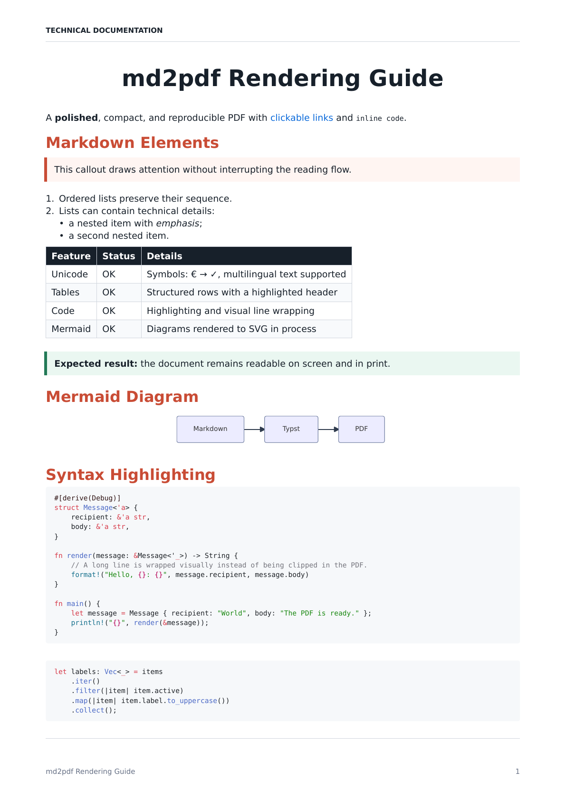

# md2pdf

[](https://github.com/0xtlt/md2pdf/actions/workflows/ci.yml)
[](LICENSE)

A fast Markdown-to-PDF converter written in Rust. Pagination, images, tables,
links, Mermaid diagrams, and syntax highlighting — no Python, browser, or
LaTeX required.



## Install

### Homebrew

Homebrew core ships a **different** Go-based `md2pdf`. Install this one with:

```console
brew install 0xtlt/tap/md2pdf
```

If `md2pdf --help` mentions `md2pdf.go`, you have the wrong package:

```console
brew uninstall md2pdf
brew install 0xtlt/tap/md2pdf
```

### Binary

Download the archive for your platform from the
[latest release](https://github.com/0xtlt/md2pdf/releases/latest).

### Cargo

```console
cargo install --git https://github.com/0xtlt/md2pdf
```

## Usage

```console
md2pdf document.md
md2pdf document.md --output build/document.pdf
md2pdf document.md --code-theme light --accent '#2563EB'
md2pdf document.md --page-size letter --landscape
cat document.md | md2pdf - --output document.pdf
```

| Option | Default | Description |
| --- | --- | --- |
| `-o, --output PATH` | source with `.pdf` | Output PDF path |
| `--title TEXT` | first `#` heading | PDF metadata title |
| `--author TEXT` | empty | PDF metadata author |
| `--page-size a4\|letter` | `a4` | Page format |
| `--landscape` | off | Landscape orientation |
| `--margin MM` | `17` | Margins (8–45 mm) |
| `--accent '#RRGGBB'` | `#C94C35` | Heading color |
| `--code-theme dark\|light` | `dark` | Code block theme |
| `--line-numbers` | off | Show code line numbers |
| `--no-header` | off | Hide page header |
| `--page-break-before PREFIX` | none | Page break before matching `##` |
| `--no-external` | off | Do not download remote images |
| `-q, --quiet` | off | Suppress success output and warnings |

Run `md2pdf --help` for the full list.

## Features

- Typst PDF engine with embedded fonts
- TextMate syntax highlighting (dark / light)
- Mermaid diagrams from `mermaid` / `mmd` fences
- Clickable links and local images
- Remote images downloaded by default (`--no-external` to deny)
- A4 / Letter, portrait or landscape
- Custom title, author, header, footer, margins, and accent

## Docs

- [Markdown support](docs/markdown-support.md)
- [Syntax highlighting](docs/syntax-highlighting.md)
- [Architecture](docs/architecture.md)
- [Contributing](CONTRIBUTING.md)

## License

[MIT](LICENSE). Embedded DejaVu fonts:
[`assets/fonts/LICENSE_DEJAVU`](assets/fonts/LICENSE_DEJAVU).
