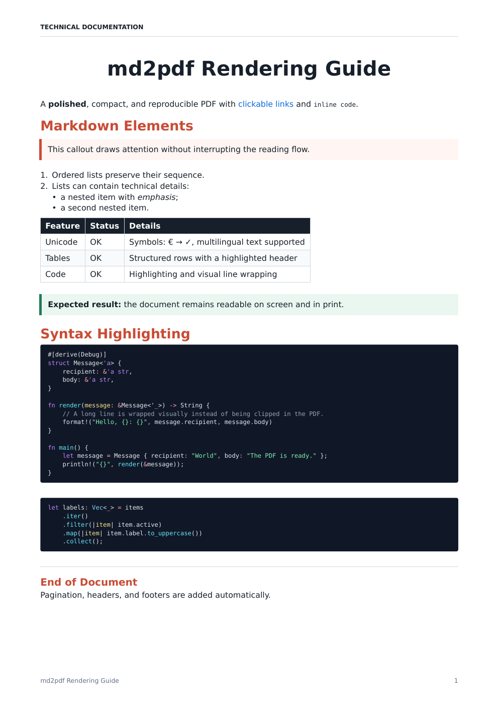
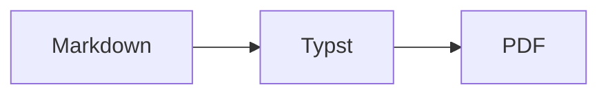

# md2pdf

[](https://github.com/0xtlt/md2pdf/actions/workflows/ci.yml)
[](LICENSE)
[](https://www.rust-lang.org/)

A fast, standalone Markdown-to-PDF converter written entirely in Rust. It
produces polished documents with pagination, local images, tables, clickable
links, Mermaid diagrams, and syntax highlighting.

**No Python, browser, LaTeX, or external runtime is required.**



## Quick start

```console
cargo build --release
./target/release/md2pdf example.md
```

The PDF is created next to the Markdown source. To choose another destination:

```console
md2pdf document.md --output build/document.pdf
```

## Features

- embedded Typst PDF engine and DejaVu fonts;
- dark or light TextMate syntax highlighting with a broad language catalog;
- Mermaid diagrams from `mermaid` / `mmd` fences rendered to SVG in process;
- automatic wrapping for long code lines;
- page-safe splitting for large code blocks;
- clickable PDF links and source-relative local images;
- A4 and Letter formats in portrait or landscape;
- customizable metadata, header, footer, margins, and accent color;
- file or standard-input sources.

Line numbers are **disabled by default**. They only appear when
`--line-numbers` is explicitly supplied.

## Installation

### Prebuilt binaries

Download the archive for your platform from the
[latest GitHub release](https://github.com/0xtlt/md2pdf/releases/latest):

| Platform | Archive |
| --- | --- |
| Linux x86_64 | [`md2pdf-linux-x86_64.tar.gz`](https://github.com/0xtlt/md2pdf/releases/latest/download/md2pdf-linux-x86_64.tar.gz) |
| Windows x86_64 | [`md2pdf-windows-x86_64.zip`](https://github.com/0xtlt/md2pdf/releases/latest/download/md2pdf-windows-x86_64.zip) |
| macOS Apple Silicon | [`md2pdf-macos-arm64.tar.gz`](https://github.com/0xtlt/md2pdf/releases/latest/download/md2pdf-macos-arm64.tar.gz) |

Each release also includes `SHA256SUMS` for archive verification.

### From source

Rust stable is required:

```console
git clone https://github.com/0xtlt/md2pdf.git
cd md2pdf
cargo install --path .
```

### Optimized local binary

```console
cargo build --release
./target/release/md2pdf --version
```

The resulting executable is available at `target/release/md2pdf`.

## Usage

```text
md2pdf [OPTIONS] [SOURCE]
```

Examples:

```console
# Default settings
md2pdf document.md

# Light code theme and a custom accent
md2pdf document.md --code-theme light --accent '#2563EB'

# Landscape US Letter
md2pdf document.md --page-size letter --landscape

# Standard input
cat document.md | md2pdf - --output document.pdf

# Explicitly enable line numbers
md2pdf document.md --line-numbers
```

Key options:

| Option | Default | Description |
| --- | --- | --- |
| `-o, --output PATH` | source with `.pdf` extension | Output PDF path |
| `--title TEXT` | first `#` heading | PDF metadata title |
| `--author TEXT` | empty | PDF metadata author |
| `--page-size a4\|letter` | `a4` | Page format |
| `--landscape` | disabled | Landscape orientation |
| `--margin MM` | `17` | Margins between 8 and 45 mm |
| `--accent '#RRGGBB'` | `#C94C35` | Heading and callout color |
| `--code-theme dark\|light` | `dark` | Code block theme |
| `--line-numbers` | disabled | Add code line numbers |
| `--no-header` | disabled | Hide the page header |
| `--page-break-before PREFIX` | none | New page before matching `##` headings |
| `-q, --quiet` | disabled | Suppress success output |

Run `md2pdf --help` for the complete list.

## Supported Markdown

Headings, paragraphs, emphasis, strikethrough, links, local images, nested
lists, task lists, tables, block quotes, horizontal rules, inline code, fenced
code blocks, and Mermaid diagrams are supported.

The detailed [Markdown support matrix](docs/markdown-support.md) documents
behavior and known limitations.

### Syntax highlighting

Fenced code blocks use full TextMate grammars rather than hand-written language
patterns. Typst's Syntect/two-face catalog handles Rust, HTML, CSS, JavaScript,
TypeScript, JSON, Python, Go, Java, C/C++, shells, SQL, YAML, TOML, and many
other languages. Liquid uses a precompiled grammar with embedded HTML, CSS,
JSON, and JavaScript support.

See the [syntax-highlighting documentation](docs/syntax-highlighting.md) for
examples, aliases, fallback behavior, and implementation details.

### Mermaid diagrams

Fenced `mermaid` (or `mmd`) blocks are rendered to SVG in process and embedded
as images. The diagram palette follows `--code-theme`. Invalid Mermaid source
stops PDF generation with an error.

````markdown

````

## Architecture

The pipeline is intentionally straightforward:

```text
Markdown -> pulldown-cmark -> Typst source (+ Mermaid SVG) -> embedded Typst -> PDF
```

Fonts, themes, and the Liquid grammar are compiled into the executable. See the
[architecture documentation](docs/architecture.md) for design choices and
layout invariants.

## Performance

Version 3.2 uses complete production grammars and remains substantially faster
and lighter than version 3.0.1. On an Apple M4 Pro:

| Workload | Peak RAM | Median time | CPU cycles |
| --- | ---: | ---: | ---: |
| Small, 1 page | 42.4 → 33.0 MiB | 36.1 → 15.2 ms | 133.8 → 62.5 million |
| Medium, 40 pages | 89.4 → 76.9 MiB | 183.6 → 106.8 ms | 744.0 → 464.4 million |
| Large, 240 pages | 310.7 → 282.4 MiB | 942.2 → 585.9 ms | 3.87 → 2.50 billion |

Each median uses ten fresh-process executions after two warm-ups. Peak resident
memory and CPU cycles are medians from three separate successful runs with
macOS `/usr/bin/time -lp`.

## Development

```console
cargo fmt --check
cargo clippy --all-targets -- -D warnings
cargo test --locked
RUSTDOCFLAGS='-D warnings' cargo doc --no-deps
```

Tests cover Markdown parsing, Typst escaping, code wrapping and pagination,
Mermaid SVG rendering, the full language catalog, embedded Liquid/HTML
highlighting, relative images, standard input, CLI errors, and actual PDF
generation.

See [CONTRIBUTING.md](CONTRIBUTING.md) for the complete workflow.

## Limitations

- remote images are not downloaded;
- raw HTML is displayed as text rather than interpreted;
- visual wrapping of long code lines can add rendered lines;
- embedded fonts prioritize readability and common Unicode coverage over
  configurable typography.

## License

The source code is licensed under the [MIT License](LICENSE). The embedded
DejaVu fonts retain their own license in
[`assets/fonts/LICENSE_DEJAVU`](assets/fonts/LICENSE_DEJAVU).
