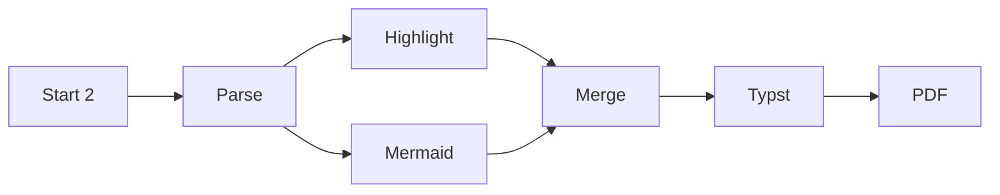
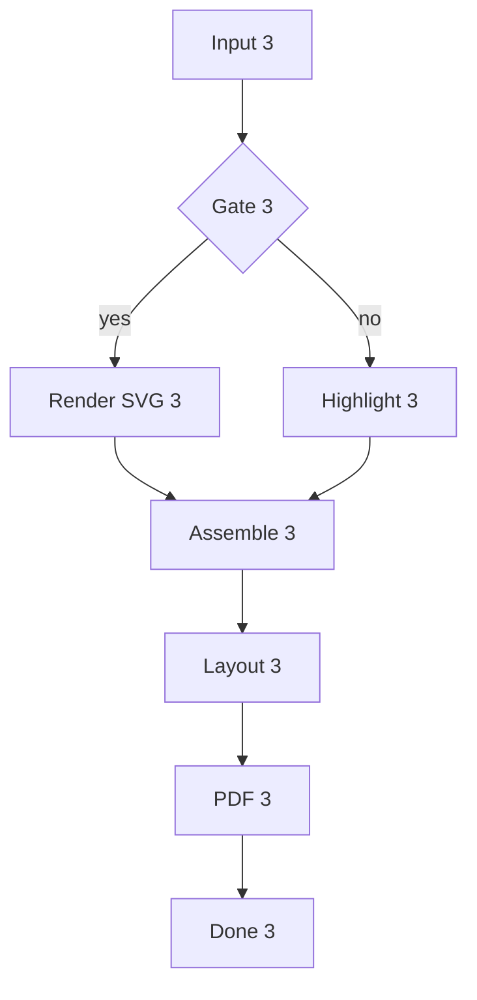
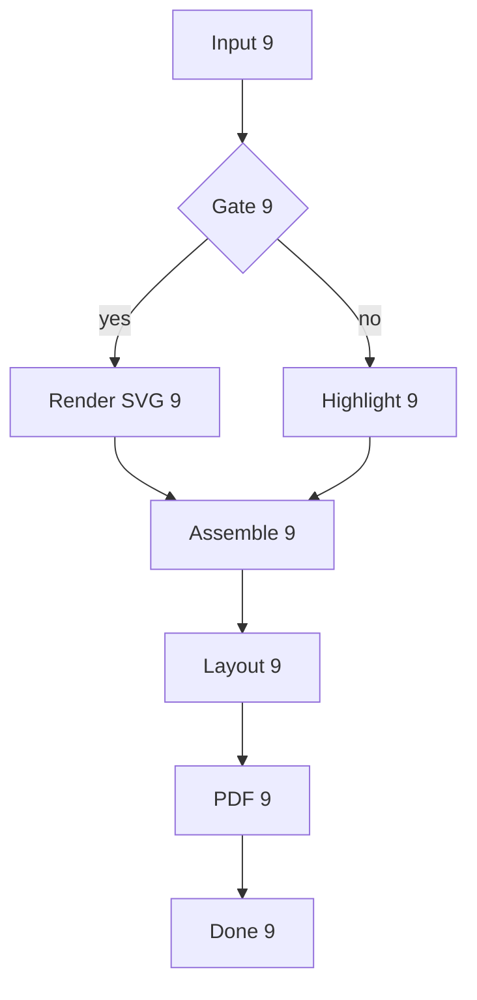
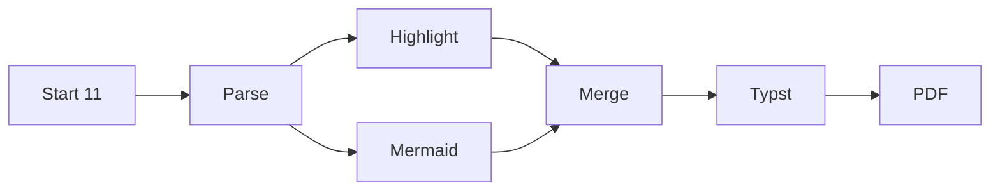
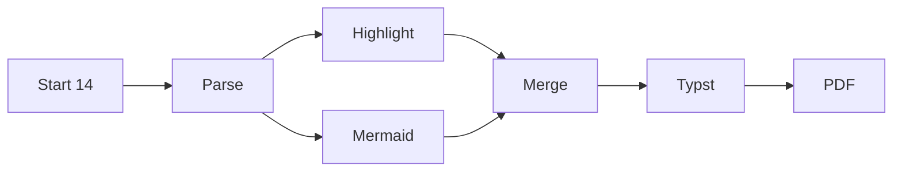
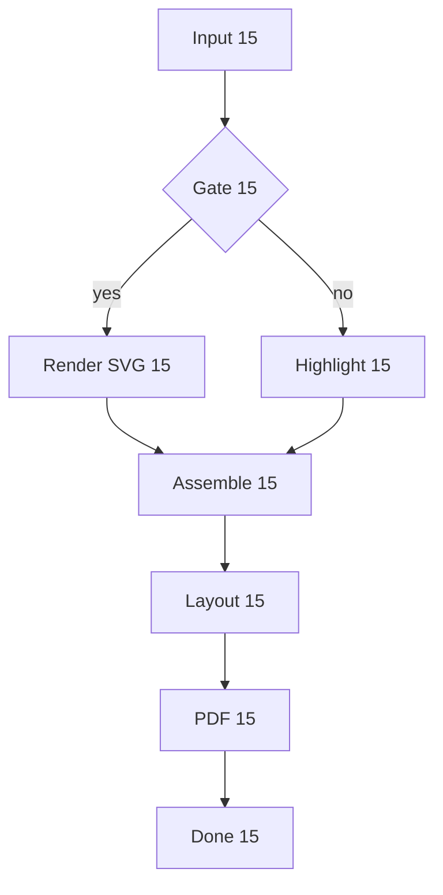
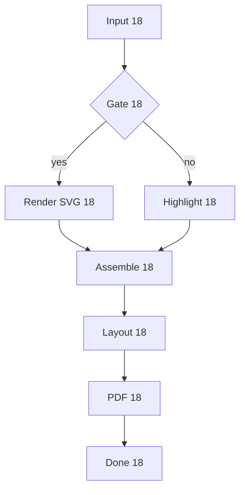
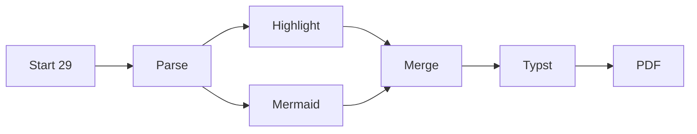

# Async Bench Fixture

Heavy Mermaid + Liquid workload for sync vs async comparison.

## Diagram 1


## Diagram 2

```mmd
sequenceDiagram
    participant U1 as User1
    participant C1 as CLI1
    participant R1 as Renderer1
    participant T1 as Typst1
    U1->>C1: convert md 1
    C1->>R1: mermaid 1
    R1-->>C1: svg 1
    C1->>T1: compile
    T1-->>U1: pdf 1
```

## Diagram 3



## Diagram 4



## Diagram 5

```mmd
sequenceDiagram
    participant U4 as User4
    participant C4 as CLI4
    participant R4 as Renderer4
    participant T4 as Typst4
    U4->>C4: convert md 4
    C4->>R4: mermaid 4
    R4-->>C4: svg 4
    C4->>T4: compile
    T4-->>U4: pdf 4
```

## Diagram 6


## Diagram 7


## Diagram 8

```mmd
sequenceDiagram
    participant U7 as User7
    participant C7 as CLI7
    participant R7 as Renderer7
    participant T7 as Typst7
    U7->>C7: convert md 7
    C7->>R7: mermaid 7
    R7-->>C7: svg 7
    C7->>T7: compile
    T7-->>U7: pdf 7
```

## Diagram 9


## Diagram 10



## Diagram 11

```mmd
sequenceDiagram
    participant U10 as User10
    participant C10 as CLI10
    participant R10 as Renderer10
    participant T10 as Typst10
    U10->>C10: convert md 10
    C10->>R10: mermaid 10
    R10-->>C10: svg 10
    C10->>T10: compile
    T10-->>U10: pdf 10
```

## Diagram 12



## Diagram 13


## Diagram 14

```mmd
sequenceDiagram
    participant U13 as User13
    participant C13 as CLI13
    participant R13 as Renderer13
    participant T13 as Typst13
    U13->>C13: convert md 13
    C13->>R13: mermaid 13
    R13-->>C13: svg 13
    C13->>T13: compile
    T13-->>U13: pdf 13
```

## Diagram 15



## Diagram 16



## Diagram 17

```mmd
sequenceDiagram
    participant U16 as User16
    participant C16 as CLI16
    participant R16 as Renderer16
    participant T16 as Typst16
    U16->>C16: convert md 16
    C16->>R16: mermaid 16
    R16-->>C16: svg 16
    C16->>T16: compile
    T16-->>U16: pdf 16
```

## Diagram 18


## Diagram 19



## Diagram 20

```mmd
sequenceDiagram
    participant U19 as User19
    participant C19 as CLI19
    participant R19 as Renderer19
    participant T19 as Typst19
    U19->>C19: convert md 19
    C19->>R19: mermaid 19
    R19-->>C19: svg 19
    C19->>T19: compile
    T19-->>U19: pdf 19
```

## Diagram 21


## Diagram 22


## Diagram 23

```mmd
sequenceDiagram
    participant U22 as User22
    participant C22 as CLI22
    participant R22 as Renderer22
    participant T22 as Typst22
    U22->>C22: convert md 22
    C22->>R22: mermaid 22
    R22-->>C22: svg 22
    C22->>T22: compile
    T22-->>U22: pdf 22
```

## Diagram 24


## Diagram 25


## Diagram 26

```mmd
sequenceDiagram
    participant U25 as User25
    participant C25 as CLI25
    participant R25 as Renderer25
    participant T25 as Typst25
    U25->>C25: convert md 25
    C25->>R25: mermaid 25
    R25-->>C25: svg 25
    C25->>T25: compile
    T25-->>U25: pdf 25
```

## Diagram 27


## Diagram 28


## Diagram 29

```mmd
sequenceDiagram
    participant U28 as User28
    participant C28 as CLI28
    participant R28 as Renderer28
    participant T28 as Typst28
    U28->>C28: convert md 28
    C28->>R28: mermaid 28
    R28-->>C28: svg 28
    C28->>T28: compile
    T28-->>U28: pdf 28
```

## Diagram 30



## Diagram 31

```mermaid
flowchart TD
    A30[Input 30] --> B30{Gate 30}
    B30 -->|yes| C30[Render SVG 30]
    B30 -->|no| D30[Highlight 30]
    C30 --> E30[Assemble 30]
    D30 --> E30
    E30 --> F30[Layout 30]
    F30 --> G30[PDF 30]
    G30 --> H30[Done 30]
```

## Diagram 32

```mmd
sequenceDiagram
    participant U31 as User31
    participant C31 as CLI31
    participant R31 as Renderer31
    participant T31 as Typst31
    U31->>C31: convert md 31
    C31->>R31: mermaid 31
    R31-->>C31: svg 31
    C31->>T31: compile
    T31-->>U31: pdf 31
```

## Diagram 33

```mermaid
flowchart LR
    S32[Start 32] --> T32[Parse]
    T32 --> U32[Highlight]
    T32 --> V32[Mermaid]
    U32 --> W32[Merge]
    V32 --> W32
    W32 --> X32[Typst]
    X32 --> Y32[PDF]
```

## Diagram 34

```mermaid
flowchart TD
    A33[Input 33] --> B33{Gate 33}
    B33 -->|yes| C33[Render SVG 33]
    B33 -->|no| D33[Highlight 33]
    C33 --> E33[Assemble 33]
    D33 --> E33
    E33 --> F33[Layout 33]
    F33 --> G33[PDF 33]
    G33 --> H33[Done 33]
```

## Diagram 35

```mmd
sequenceDiagram
    participant U34 as User34
    participant C34 as CLI34
    participant R34 as Renderer34
    participant T34 as Typst34
    U34->>C34: convert md 34
    C34->>R34: mermaid 34
    R34-->>C34: svg 34
    C34->>T34: compile
    T34-->>U34: pdf 34
```

## Diagram 36

```mermaid
flowchart LR
    S35[Start 35] --> T35[Parse]
    T35 --> U35[Highlight]
    T35 --> V35[Mermaid]
    U35 --> W35[Merge]
    V35 --> W35
    W35 --> X35[Typst]
    X35 --> Y35[PDF]
```

## Diagram 37

```mermaid
flowchart TD
    A36[Input 36] --> B36{Gate 36}
    B36 -->|yes| C36[Render SVG 36]
    B36 -->|no| D36[Highlight 36]
    C36 --> E36[Assemble 36]
    D36 --> E36
    E36 --> F36[Layout 36]
    F36 --> G36[PDF 36]
    G36 --> H36[Done 36]
```

## Diagram 38

```mmd
sequenceDiagram
    participant U37 as User37
    participant C37 as CLI37
    participant R37 as Renderer37
    participant T37 as Typst37
    U37->>C37: convert md 37
    C37->>R37: mermaid 37
    R37-->>C37: svg 37
    C37->>T37: compile
    T37-->>U37: pdf 37
```

## Diagram 39

```mermaid
flowchart LR
    S38[Start 38] --> T38[Parse]
    T38 --> U38[Highlight]
    T38 --> V38[Mermaid]
    U38 --> W38[Merge]
    V38 --> W38
    W38 --> X38[Typst]
    X38 --> Y38[PDF]
```

## Diagram 40

```mermaid
flowchart TD
    A39[Input 39] --> B39{Gate 39}
    B39 -->|yes| C39[Render SVG 39]
    B39 -->|no| D39[Highlight 39]
    C39 --> E39[Assemble 39]
    D39 --> E39
    E39 --> F39[Layout 39]
    F39 --> G39[PDF 39]
    G39 --> H39[Done 39]
```

## Diagram 41

```mmd
sequenceDiagram
    participant U40 as User40
    participant C40 as CLI40
    participant R40 as Renderer40
    participant T40 as Typst40
    U40->>C40: convert md 40
    C40->>R40: mermaid 40
    R40-->>C40: svg 40
    C40->>T40: compile
    T40-->>U40: pdf 40
```

## Diagram 42

```mermaid
flowchart LR
    S41[Start 41] --> T41[Parse]
    T41 --> U41[Highlight]
    T41 --> V41[Mermaid]
    U41 --> W41[Merge]
    V41 --> W41
    W41 --> X41[Typst]
    X41 --> Y41[PDF]
```

## Diagram 43

```mermaid
flowchart TD
    A42[Input 42] --> B42{Gate 42}
    B42 -->|yes| C42[Render SVG 42]
    B42 -->|no| D42[Highlight 42]
    C42 --> E42[Assemble 42]
    D42 --> E42
    E42 --> F42[Layout 42]
    F42 --> G42[PDF 42]
    G42 --> H42[Done 42]
```

## Diagram 44

```mmd
sequenceDiagram
    participant U43 as User43
    participant C43 as CLI43
    participant R43 as Renderer43
    participant T43 as Typst43
    U43->>C43: convert md 43
    C43->>R43: mermaid 43
    R43-->>C43: svg 43
    C43->>T43: compile
    T43-->>U43: pdf 43
```

## Diagram 45

```mermaid
flowchart LR
    S44[Start 44] --> T44[Parse]
    T44 --> U44[Highlight]
    T44 --> V44[Mermaid]
    U44 --> W44[Merge]
    V44 --> W44
    W44 --> X44[Typst]
    X44 --> Y44[PDF]
```

## Diagram 46

```mermaid
flowchart TD
    A45[Input 45] --> B45{Gate 45}
    B45 -->|yes| C45[Render SVG 45]
    B45 -->|no| D45[Highlight 45]
    C45 --> E45[Assemble 45]
    D45 --> E45
    E45 --> F45[Layout 45]
    F45 --> G45[PDF 45]
    G45 --> H45[Done 45]
```

## Diagram 47

```mmd
sequenceDiagram
    participant U46 as User46
    participant C46 as CLI46
    participant R46 as Renderer46
    participant T46 as Typst46
    U46->>C46: convert md 46
    C46->>R46: mermaid 46
    R46-->>C46: svg 46
    C46->>T46: compile
    T46-->>U46: pdf 46
```

## Diagram 48

```mermaid
flowchart LR
    S47[Start 47] --> T47[Parse]
    T47 --> U47[Highlight]
    T47 --> V47[Mermaid]
    U47 --> W47[Merge]
    V47 --> W47
    W47 --> X47[Typst]
    X47 --> Y47[PDF]
```

## Liquid 1

```liquid

  <div class="card-0">
    <h2>{{ product_0.title | escape }}</h2>
    <p class="price">{{ product_0.price | money }}</p>
    
      <li data-sku="{{ variant.sku }}">{{ variant.title }} - {{ variant.price | money }}</li>
    
  </div>

  <p class="sold-out">Sold out item 0</p>

```

## Liquid 2

```liquid

  <div class="card-1">
    <h2>{{ product_1.title | escape }}</h2>
    <p class="price">{{ product_1.price | money }}</p>
    
      <li data-sku="{{ variant.sku }}">{{ variant.title }} - {{ variant.price | money }}</li>
    
  </div>

  <p class="sold-out">Sold out item 1</p>

```

## Liquid 3

```liquid

  <div class="card-2">
    <h2>{{ product_2.title | escape }}</h2>
    <p class="price">{{ product_2.price | money }}</p>
    
      <li data-sku="{{ variant.sku }}">{{ variant.title }} - {{ variant.price | money }}</li>
    
  </div>

  <p class="sold-out">Sold out item 2</p>

```

## Liquid 4

```liquid

  <div class="card-3">
    <h2>{{ product_3.title | escape }}</h2>
    <p class="price">{{ product_3.price | money }}</p>
    
      <li data-sku="{{ variant.sku }}">{{ variant.title }} - {{ variant.price | money }}</li>
    
  </div>

  <p class="sold-out">Sold out item 3</p>

```

## Liquid 5

```liquid

  <div class="card-4">
    <h2>{{ product_4.title | escape }}</h2>
    <p class="price">{{ product_4.price | money }}</p>
    
      <li data-sku="{{ variant.sku }}">{{ variant.title }} - {{ variant.price | money }}</li>
    
  </div>

  <p class="sold-out">Sold out item 4</p>

```

## Liquid 6

```liquid

  <div class="card-5">
    <h2>{{ product_5.title | escape }}</h2>
    <p class="price">{{ product_5.price | money }}</p>
    
      <li data-sku="{{ variant.sku }}">{{ variant.title }} - {{ variant.price | money }}</li>
    
  </div>

  <p class="sold-out">Sold out item 5</p>

```

## Liquid 7

```liquid

  <div class="card-6">
    <h2>{{ product_6.title | escape }}</h2>
    <p class="price">{{ product_6.price | money }}</p>
    
      <li data-sku="{{ variant.sku }}">{{ variant.title }} - {{ variant.price | money }}</li>
    
  </div>

  <p class="sold-out">Sold out item 6</p>

```

## Liquid 8

```liquid

  <div class="card-7">
    <h2>{{ product_7.title | escape }}</h2>
    <p class="price">{{ product_7.price | money }}</p>
    
      <li data-sku="{{ variant.sku }}">{{ variant.title }} - {{ variant.price | money }}</li>
    
  </div>

  <p class="sold-out">Sold out item 7</p>

```

## Liquid 9

```liquid

  <div class="card-8">
    <h2>{{ product_8.title | escape }}</h2>
    <p class="price">{{ product_8.price | money }}</p>
    
      <li data-sku="{{ variant.sku }}">{{ variant.title }} - {{ variant.price | money }}</li>
    
  </div>

  <p class="sold-out">Sold out item 8</p>

```

## Liquid 10

```liquid

  <div class="card-9">
    <h2>{{ product_9.title | escape }}</h2>
    <p class="price">{{ product_9.price | money }}</p>
    
      <li data-sku="{{ variant.sku }}">{{ variant.title }} - {{ variant.price | money }}</li>
    
  </div>

  <p class="sold-out">Sold out item 9</p>

```

## Liquid 11

```liquid

  <div class="card-10">
    <h2>{{ product_10.title | escape }}</h2>
    <p class="price">{{ product_10.price | money }}</p>
    
      <li data-sku="{{ variant.sku }}">{{ variant.title }} - {{ variant.price | money }}</li>
    
  </div>

  <p class="sold-out">Sold out item 10</p>

```

## Liquid 12

```liquid

  <div class="card-11">
    <h2>{{ product_11.title | escape }}</h2>
    <p class="price">{{ product_11.price | money }}</p>
    
      <li data-sku="{{ variant.sku }}">{{ variant.title }} - {{ variant.price | money }}</li>
    
  </div>

  <p class="sold-out">Sold out item 11</p>

```

## Liquid 13

```liquid

  <div class="card-12">
    <h2>{{ product_12.title | escape }}</h2>
    <p class="price">{{ product_12.price | money }}</p>
    
      <li data-sku="{{ variant.sku }}">{{ variant.title }} - {{ variant.price | money }}</li>
    
  </div>

  <p class="sold-out">Sold out item 12</p>

```

## Liquid 14

```liquid

  <div class="card-13">
    <h2>{{ product_13.title | escape }}</h2>
    <p class="price">{{ product_13.price | money }}</p>
    
      <li data-sku="{{ variant.sku }}">{{ variant.title }} - {{ variant.price | money }}</li>
    
  </div>

  <p class="sold-out">Sold out item 13</p>

```

## Liquid 15

```liquid

  <div class="card-14">
    <h2>{{ product_14.title | escape }}</h2>
    <p class="price">{{ product_14.price | money }}</p>
    
      <li data-sku="{{ variant.sku }}">{{ variant.title }} - {{ variant.price | money }}</li>
    
  </div>

  <p class="sold-out">Sold out item 14</p>

```

## Liquid 16

```liquid

  <div class="card-15">
    <h2>{{ product_15.title | escape }}</h2>
    <p class="price">{{ product_15.price | money }}</p>
    
      <li data-sku="{{ variant.sku }}">{{ variant.title }} - {{ variant.price | money }}</li>
    
  </div>

  <p class="sold-out">Sold out item 15</p>

```

## Liquid 17

```liquid

  <div class="card-16">
    <h2>{{ product_16.title | escape }}</h2>
    <p class="price">{{ product_16.price | money }}</p>
    
      <li data-sku="{{ variant.sku }}">{{ variant.title }} - {{ variant.price | money }}</li>
    
  </div>

  <p class="sold-out">Sold out item 16</p>

```

## Liquid 18

```liquid

  <div class="card-17">
    <h2>{{ product_17.title | escape }}</h2>
    <p class="price">{{ product_17.price | money }}</p>
    
      <li data-sku="{{ variant.sku }}">{{ variant.title }} - {{ variant.price | money }}</li>
    
  </div>

  <p class="sold-out">Sold out item 17</p>

```

## Liquid 19

```liquid

  <div class="card-18">
    <h2>{{ product_18.title | escape }}</h2>
    <p class="price">{{ product_18.price | money }}</p>
    
      <li data-sku="{{ variant.sku }}">{{ variant.title }} - {{ variant.price | money }}</li>
    
  </div>

  <p class="sold-out">Sold out item 18</p>

```

## Liquid 20

```liquid

  <div class="card-19">
    <h2>{{ product_19.title | escape }}</h2>
    <p class="price">{{ product_19.price | money }}</p>
    
      <li data-sku="{{ variant.sku }}">{{ variant.title }} - {{ variant.price | money }}</li>
    
  </div>

  <p class="sold-out">Sold out item 19</p>

```

## Liquid 21

```liquid

  <div class="card-20">
    <h2>{{ product_20.title | escape }}</h2>
    <p class="price">{{ product_20.price | money }}</p>
    
      <li data-sku="{{ variant.sku }}">{{ variant.title }} - {{ variant.price | money }}</li>
    
  </div>

  <p class="sold-out">Sold out item 20</p>

```

## Liquid 22

```liquid

  <div class="card-21">
    <h2>{{ product_21.title | escape }}</h2>
    <p class="price">{{ product_21.price | money }}</p>
    
      <li data-sku="{{ variant.sku }}">{{ variant.title }} - {{ variant.price | money }}</li>
    
  </div>

  <p class="sold-out">Sold out item 21</p>

```

## Liquid 23

```liquid

  <div class="card-22">
    <h2>{{ product_22.title | escape }}</h2>
    <p class="price">{{ product_22.price | money }}</p>
    
      <li data-sku="{{ variant.sku }}">{{ variant.title }} - {{ variant.price | money }}</li>
    
  </div>

  <p class="sold-out">Sold out item 22</p>

```

## Liquid 24

```liquid

  <div class="card-23">
    <h2>{{ product_23.title | escape }}</h2>
    <p class="price">{{ product_23.price | money }}</p>
    
      <li data-sku="{{ variant.sku }}">{{ variant.title }} - {{ variant.price | money }}</li>
    
  </div>

  <p class="sold-out">Sold out item 23</p>

```

## Rust 1

```rust
fn render_0(input: &str) -> String {
    let mut out = String::new();
    for (idx, line) in input.lines().enumerate() {
        out.push_str(&format!("{idx}: {line}\n"));
    }
    out
}
```

## Rust 2

```rust
fn render_1(input: &str) -> String {
    let mut out = String::new();
    for (idx, line) in input.lines().enumerate() {
        out.push_str(&format!("{idx}: {line}\n"));
    }
    out
}
```

## Rust 3

```rust
fn render_2(input: &str) -> String {
    let mut out = String::new();
    for (idx, line) in input.lines().enumerate() {
        out.push_str(&format!("{idx}: {line}\n"));
    }
    out
}
```

## Rust 4

```rust
fn render_3(input: &str) -> String {
    let mut out = String::new();
    for (idx, line) in input.lines().enumerate() {
        out.push_str(&format!("{idx}: {line}\n"));
    }
    out
}
```

## Rust 5

```rust
fn render_4(input: &str) -> String {
    let mut out = String::new();
    for (idx, line) in input.lines().enumerate() {
        out.push_str(&format!("{idx}: {line}\n"));
    }
    out
}
```

## Rust 6

```rust
fn render_5(input: &str) -> String {
    let mut out = String::new();
    for (idx, line) in input.lines().enumerate() {
        out.push_str(&format!("{idx}: {line}\n"));
    }
    out
}
```

## Rust 7

```rust
fn render_6(input: &str) -> String {
    let mut out = String::new();
    for (idx, line) in input.lines().enumerate() {
        out.push_str(&format!("{idx}: {line}\n"));
    }
    out
}
```

## Rust 8

```rust
fn render_7(input: &str) -> String {
    let mut out = String::new();
    for (idx, line) in input.lines().enumerate() {
        out.push_str(&format!("{idx}: {line}\n"));
    }
    out
}
```
