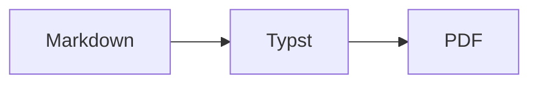

# md2pdf Rendering Guide

A **polished**, compact, and reproducible PDF with [clickable
links](https://www.rust-lang.org/) and `inline code`.

## Markdown Elements

> This callout draws attention without interrupting the reading flow.

1. Ordered lists preserve their sequence.
2. Lists can contain technical details:
   - a nested item with *emphasis*;
   - a second nested item.

| Feature | Status | Details |
| --- | :---: | --- |
| Unicode | OK | Symbols: € → ✓, multilingual text supported |
| Tables | OK | Structured rows with a highlighted header |
| Code | OK | Highlighting and visual line wrapping |
| Mermaid | OK | Diagrams rendered to SVG in process |

**Expected result:** the document remains readable on screen and in print.

## Mermaid Diagram



## Syntax Highlighting

```rust
#[derive(Debug)]
struct Message<'a> {
    recipient: &'a str,
    body: &'a str,
}

fn render(message: &Message<'_>) -> String {
    // A long line is wrapped visually instead of being clipped in the PDF.
    format!("Hello, {}: {}", message.recipient, message.body)
}

fn main() {
    let message = Message { recipient: "World", body: "The PDF is ready." };
    println!("{}", render(&message));
}
```

```rust
let labels: Vec<_> = items
    .iter()
    .filter(|item| item.active)
    .map(|item| item.label.to_uppercase())
    .collect();
```

---

### End of Document

Pagination, headers, and footers are added automatically.
