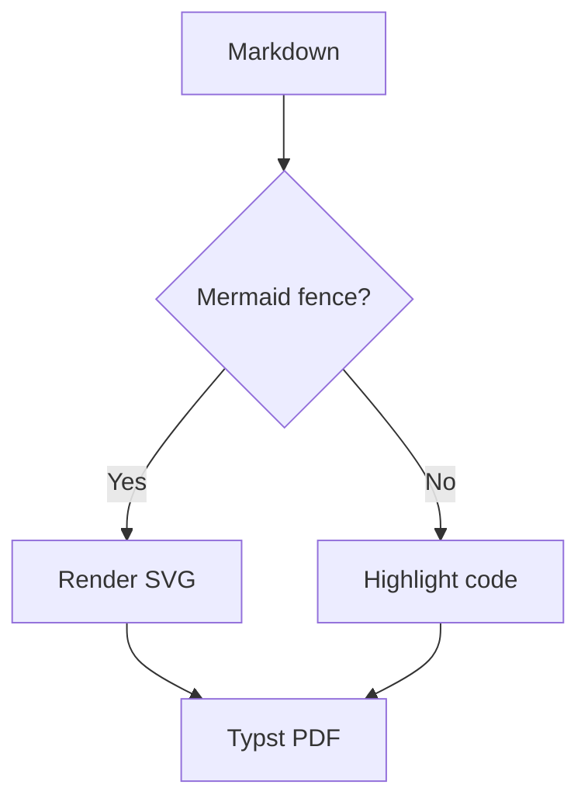

# Mermaid Support


```mermaid
flowchart TD
    A[Markdown] --> B{Mermaid fence?}
    B -->|Yes| C[Render SVG]
    B -->|No| D[Highlight code]
    C --> E[Typst PDF]
    D --> E
```

A second diagram uses the `mmd` alias:

```mmd
sequenceDiagram
    participant User
    participant md2pdf
    User->>md2pdf: document.md
    md2pdf-->>User: document.pdf
```
